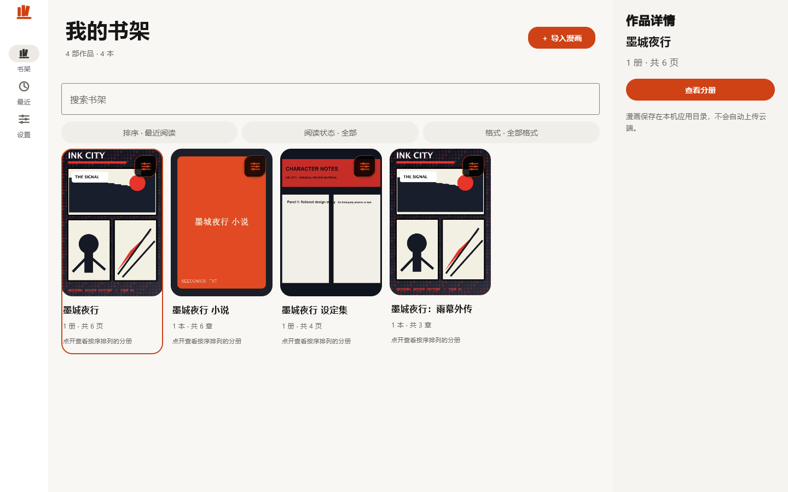

<picture>
  <source media="(max-width: 600px)" srcset="assets/banner-mobile.svg">
  
</picture>

  <a href="https://fanxu1218.github.io/appShow/"><strong>AppShow · 我的应用作品集 ↗</strong></a>

  <a href="https://fanxu1218.github.io/HelloSkill/">SkillDock</a> &nbsp; · &nbsp;
  <a href="https://study.fanxu12180618.chatgpt.site/">渐进式编程课</a> &nbsp; · &nbsp;
  <a href="https://fanxu1218.github.io/TaoYingHotPoint/">饕影热点</a>

独立开发者，关注 **HarmonyOS 与跨平台开发**，也把 **AI 工作流、Web 应用和自动化**变成日常创作的一部分。

从一个想解决的小问题出发，琢磨交互、写下代码，再把作品带到真实的使用场景里。

## 01 · AppShow / 应用作品集

<a href="https://fanxu1218.github.io/appShow/">
  <picture>
    <source media="(max-width: 600px)" srcset="assets/appshow-mobile.svg">
    
  </picture>
</a>

**想法不只停在脑海里，也可以成为每天打开的应用。**

AppShow 是我的独立应用橱窗，记录产品想法、真实界面与发布进展。当前主打 **漫架（SeeComics）**：为漫画、PDF 和小说准备的一座本地书架，让故事有处安放，让阅读更专注。

`独立应用` `产品设计` `本地优先` `持续创造`

**[打开作品集 ↗](https://fanxu1218.github.io/appShow/)** &nbsp; / &nbsp; [认识漫架](https://fanxu1218.github.io/appShow/apps/manjia/) &nbsp; / &nbsp; [展示站源码](https://github.com/fanxu1218/appShow)

  
展开漫架 Windows 真实界面

   
  
  
截图来自 AppShow。Windows 版已上线，各平台发布进展见作品介绍页。

## 更多创造，从不同的问题出发

### 02 · SkillDock

**从一个真实任务，找到合适的 Skill 组合。**

面向中文用户的 Skill 发现与工作流网站，支持任务推荐、分类浏览与目录搜索，让零散的能力连成可用的工作流。

`AI 工作流` `React` `Vite` `JavaScript`

[打开网站 ↗](https://fanxu1218.github.io/HelloSkill/) &nbsp; / &nbsp; [查看源码](https://github.com/fanxu1218/HelloSkill)

---

### 03 · 渐进式编程课

**一次一个主题，让学习持续发生。**

中文编程与数字创作学习项目，覆盖编程语言、应用开发、Web、游戏引擎与设计工具；用小示例、短练习和参考答案串起学习路径。

`学习记录` `TypeScript` `React` `Markdown`

[打开网站 ↗](https://study.fanxu12180618.chatgpt.site/) &nbsp; / &nbsp; [浏览课程](https://github.com/fanxu1218/Study_Fastion_Lanuguage/tree/main/content) &nbsp; / &nbsp; [查看源码](https://github.com/fanxu1218/Study_Fastion_Lanuguage)

---

### 04 · 饕影热点

**把分散的热点，放到同一个入口。**

聚合多个平台的公开热点榜，支持平台筛选、日期查询、标题搜索与原文跳转，连接自动采集、数据存储和网页展示。

`Python` `React` `PostgreSQL` `GitHub Actions`

[打开网站 ↗](https://fanxu1218.github.io/TaoYingHotPoint/) &nbsp; / &nbsp; [查看源码](https://github.com/fanxu1218/TaoYingHotPoint)

## 技术与探索

**应用与跨平台**

  
  
  
  

**Web 与自动化**

  
  
  
  

## 保持创造，也持续打磨

- **独立应用** — 从自己的使用需求出发，打磨交互与阅读体验，在 AppShow 记录作品进展。
- **工作流** — 把真实任务整理成可复用的 Skill 组合。
- **学习路径** — 用小步课程记录知识，用练习检验理解。
- **实用工具** — 让采集、数据和界面配合起来，解决具体问题。

  
更多开源探索

   
  <a href="https://github.com/fanxu1218/fanxuwmproxy"><strong>fanxuwmproxy</strong></a>：基于 <a href="https://github.com/tickbh/wmproxy">tickbh/wmproxy</a> 的 Fork，探索 Rust 网络代理与转发。

---

  欢迎在相关项目提交 Issue，交流使用体验与改进想法。 
  保持好奇，持续构建。 · Thanks for stopping by.

